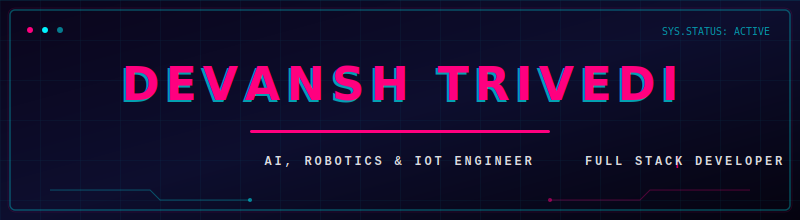

<h1 align="center">Hi 👋, I'm Devansh Trivedi</h1>
<h3 align="center">AI & Robotics Developer</h3>

  

 

### 💫 About Me:
- 🔭 Currently working on <strong>AI &amp; Robotics Projects, and IoT-Based Smart Solutions</strong>
- 👯 Looking to collaborate on <strong>Artificial Intelligence, Machine Learning, Robotics, and Open-Source Projects</strong>
- 🤝 Seeking guidance with <strong>Advanced Deep Learning, Computer Vision, and Real-Time AI Applications</strong>
- 🌱 Currently learning <strong>Generative AI, Advanced Machine Learning, and Full-Stack Development</strong>
- 💬 Ask me about <strong>Python, AI/ML, Robotics, Arduino, IoT, OpenCV, and Web Development</strong>
- ⚡ Fun fact: <strong>I enjoy turning innovative ideas into real-world AI and robotics projects that solve practical problems.</strong>

 

### 🌐 Connect with me:

  
  
  
  

 

### 🏆 GitHub Trophies:

  

 

<!-- Retro Arcade Section -->

  
<b>🕹️ devansh's Retro Arcade Room</b>

   
  

    
Enjoy a classic game of Pac-Man running on my actual GitHub contributions!

    <table border="1" cellpadding="20" bordercolor="#444444" style="border-radius: 15px; backdrop-filter: blur(10px); background: rgba(255, 255, 255, 0.05); border: 1px solid rgba(255, 255, 255, 0.1);">
      <tr>
        <td align="center">
          <picture>
            
          </picture>
        </td>
      </tr>
    </table>
  

 

### 💻 Tech Stack:

<table width="100%">
  <tr>
    <td align="center" width="25%"><b>Programming Languages</b></td>
    <td>
      
      
      
      
      
    </td>
  </tr>
  <tr>
    <td align="center" width="25%"><b>AI &amp; Data Science</b></td>
    <td>
      
      
      
      
      
      
      
    </td>
  </tr>
  <tr>
    <td align="center" width="25%"><b>Robotics &amp; IoT</b></td>
    <td>
      
      
      
    </td>
  </tr>
  <tr>
    <td align="center" width="25%"><b>DevOps &amp; Tools</b></td>
    <td>
      
      
    </td>
  </tr>
</table>

 

### 📊 GitHub Stats:

  <table border="0" style="border-collapse: collapse; border: none;">
    <tr style="border: none;">
      <td style="border: none; padding: 5px;">
        
      </td>
      <td style="border: none; padding: 5px;">
        
      </td>
    </tr>
    <tr style="border: none;">
      <td style="border: none; padding: 5px;" colspan="2" align="center">
        
      </td>
    </tr>
  </table>

 

### ✍️ Random Dev Quote:

  

 

### 💻 Featured Projects:

  
  

 

  
  

 

  
   
   
  Created with ❤️ and powered by GitHub Actions

<!-- Co-authored-by: Antigravity <antigravity-bot@google.com> -->

